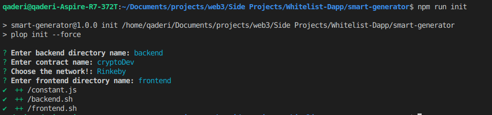
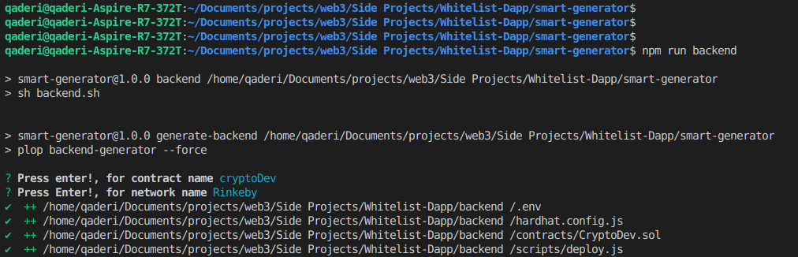

# Smart Generator

The repetitive tasks are boring and most time-consuming while developing a project, and most of the projects have share points initially.
This package is for a web3 project that consists of backend and frontend. To prepare a project we need a bunch of commands for creating directories, project initialization, installing dependencies, adding initial shared code, and much more on both ends.

Hey, Developers! Don't worry, as a LearnWeb3DAO school student, I resolved these concerns for you.😍

Just by cloning this tiny repository you will be able to prepare the project along with essential code that is shared between all common projects by running 3 or 4 commands instead typing a lot of commands manually.
## Prerequisite
- You need to install node.js. If you don't have it installed in your computer, download it from [here](https://nodejs.org/en/download/) 
- You need to install plopjs, execute the following command to install it
```
npm install -g plop
```
Plopjs is a Javascript package which is used for files and code generation and this smart-generator is developd on top of plopjs. Go to [plopj documention](https://plopjs.com/) for further corospendance.

We need to install plopjs globally in order to use it for different projects.
## How it works 
This project only works if you want to develop smart contract using hardhat in backend and next.js in frontend 

- Run the following commands to get prepare your  project's backend and frontend
```
mkdir quiz-dapp // Name whatever your project is 
cd quiz-dapp
git clone https://github.com/qaderi-coding/smart-generator
cd smart-generator 
npm run init // Generates scripts that we will run later 
npm run backend // Installs all essential backend dependencies and will generate backend common code required by a project
npm run frontend // Installs all essential frontend dependencies and will generate frontend common code required by a project
```
Boom, you avoided time consumption, enjoy the saved time! 😀
## You still don't know how it works, let's try an example 
### Requirements 
- We want to develop a Whitelist-Dapp for instance.

Let's see how smart-generator package generates the essential code for us and how it installs all required dependencies for backend and frontend.
### Backend 

Cool, to run the package for backend, follow the instructions below.
- First, you need to create a folder where you will have your backend and frontend folders
- Open up terminal and execute the following commands
```
mkdir Whitelist-Dapp
cd Whitelist-Dapp
```
- Then, execute the following command to clone the smart-generator repository
```
git clone https://github.com/qaderi-coding/smart-generator.git
```

Now, switch to the directory and execute the following commands.
```
cd smart-generator
npm run init
```


This command will prompt you to enter:
- Backend directory name where your smart contracts will go later, if you want to choose default name `hardhat-tutorial` for your backend folder, don't type, press enter!
- Contract name that we will use for variable and file names needed in the code
- Network name that we will use for constant and normal variables in the code
- Frontend directory name where your frontend website will be placed, If you want the default name `my-app` for frontend, don't type, press enter!

Now, it is time to install backend dependencies along with common code. So execute the following command

```
npm run backend
```

This one command will save you from installing dependencies manually, and will:
- Make directory for backend that you entered earlier
- Switch to the created directory 
- Initiate the npm package for your backend through running the `npm init --yes` command
- Install hardhat dependency through running the `npm install --save-dev hardhat` command
- Install env package through running the `npm install dotenv`
- initiate hardhat project through running the `npx hardhat` command.


Once the dependencies are get installed you will be prompted to confirm the contract and network names that you entered earlier. Please, press enter, don't type anything.



Then, the command will create the following files along with code.
- First, it will create a contract file by the name of that you entered earlier with the following code
```
// SPDX-License-Identifier: MIT
pragma solidity ^0.8.4;

contract CryptoDev {

}
```
- Second, it will create env file with the following code according to the network that you entered earlier
```
// Go to https://www.alchemyapi.io, sign up, create
// a new App in its dashboard and select the network as Rinkeby, and replace "add-the-alchemy-key-url-here" with its key url
ALCHEMY_API_KEY_URL=""

// Replace this private key with your RINKEBY account private key
// To export your private key from Metamask, open Metamask and
// go to Account Details > Export Private Key
// Be aware of NEVER putting real Ether into testing accounts
RINKEBY_PRIVATE_KEY=""
``` 
- Third, it will create deploy.js file with the following code according to contract and network names that you chose earlier
```
const { ethers } = require("hardhat");

async function main() {
  /*
  A ContractFactory in ethers.js is an abstraction used to deploy new smart contracts,
  so whitelistContract here is a factory for instances of our Whitelist contract.
  */
  const cryptoDevContract = await ethers.getContractFactory("CryptoDev");

  // here we deploy the contract
  const deployedCryptoDevContract = await cryptoDevContract.deploy();
  
  // Wait for it to finish deploying
  await deployedCryptoDevContract.deployed();

  // print the address of the deployed contract
  console.log(
    "CryptoDev Contract Address:",
    deployedCryptoDevContract.address
  );
}

// Call the main function and catch if there is any error
main()
  .then(() => process.exit(0))
  .catch((error) => {
    console.error(error);
    process.exit(1);
  })
```
- Fourth, it will change the hardhat.config.js code according to the network that you chose earlier 
```
require("@nomiclabs/hardhat-waffle");
require("dotenv").config({ path: ".env" });

const ALCHEMY_API_KEY_URL = process.env.ALCHEMY_API_KEY_URL;

const RINKEBY_PRIVATE_KEY = process.env.RINKEBY_PRIVATE_KEY;

module.exports = {
  solidity: "0.8.4",
  networks: {
    rinkeby: {
      url: ALCHEMY_API_KEY_URL,
      accounts: [RINKEBY_PRIVATE_KEY],
    },
  },
};
```

Awesome, executing this one command `npm run backend` did all stuff for us dynamically as per our inputs to prepare the backend.

## Frontend 
Now, that we prepared our backend, it is time to get prepare our frontend.
Let's go.🚀

- Execute the following command to generate the essential code and install the dependencies needed by a common project for our frontend.
```
npm run frontend
```
This command will save your time and will:
- Create the directory for frontend by the name you entered earlier
- Switch to the created directory 
- Install and initiate next.js through running the `npx create-next-app@latest` command
- Install web3modal package through running the `npm install web3modal`
- Install ethers.js package through running the `npm install ethers` command

Once the dependencies are get installed you will be prompted to confirm the contract and network names that you entered earlier. Please, press enter, don't type anything.


Then, it will create the following files along with common code 

- First, it will create constant file along with following code 
```
export const CRYPTODEV_ADDRESS = "address of your cryptodev contract"
export const abi = []
```
- Second, it will change the index.js code to the following initial code needed by a common project to connect a wallet and sign or provide a transaction 
```
import { providers } from "ethers";
import React, { useEffect, useRef, useState } from "react";
import Web3Modal from "web3modal";
import { abi, CRYPTODEV_ADDRESS } from "../constants";

export default function Home() {
  // walletConnected keep track of whether the user's wallet is connected or not
  const [walletConnected, setWalletConnected] = useState(false);
  // loading is set to true when we are waiting 
  const [loading, setLoading] = useState(false);
  // Create a reference to the Web3 Modal (used for connecting to Metamask) which persists as long as the page is open
  const web3ModalRef = useRef();

  /*
      connectWallet: Connects the MetaMask wallet
    */
  const connectWallet = async () => {
    try {
      // Get the provider from web3Modal, which in our case is MetaMask
      // When used for the first time, it prompts the user to connect their wallet
      await getProviderOrSigner();
      setWalletConnected(true);
    } catch (err) {
      console.error(err);
    }
  };

  /**
   * Returns a Provider or Signer object representing the Ethereum RPC with or without the
   * signing capabilities of metamask attached
   *
   * A `Provider` is needed to interact with the blockchain - reading transactions, reading balances, reading state, etc.
   *
   * A `Signer` is a special type of Provider used in case a `write` transaction needs to be made to the blockchain, which involves the connected account
   * needing to make a digital signature to authorize the transaction being sent. Metamask exposes a Signer API to allow your website to
   * request signatures from the user using Signer functions.
   *
   * @param {*} needSigner - True if you need the signer, default false otherwise
   */
  const getProviderOrSigner = async (needSigner = false) => {
    // Connect to Metamask
    // Since we store `web3Modal` as a reference, we need to access the `current` value to get access to the underlying object
    const provider = await web3ModalRef.current.connect();
    const web3Provider = new providers.Web3Provider(provider);

    // If user is not connected to the Rinkeby network, let them know and throw an error
    const { chainId } = await web3Provider.getNetwork();
    if (chainId !== null) {
      window.alert("Change the network to Rinkeby");
      throw new Error("Change network to Rinkeby");
    }

    if (needSigner) {
      const signer = web3Provider.getSigner();
      return signer;
    }
    return web3Provider;
  };

  // useEffects are used to react to changes in state of the website
  // The array at the end of function call represents what state changes will trigger this effect
  // In this case, whenever the value of `walletConnected` changes - this effect will be called
  useEffect(() => {
    // if wallet is not connected, create a new instance of Web3Modal and connect the MetaMask wallet
    if (!walletConnected) {
      // Assign the Web3Modal class to the reference object by setting it's `current` value
      // The `current` value is persisted throughout as long as this page is open
      web3ModalRef.current = new Web3Modal({
        network: "rinkeby",
        providerOptions: {},
        disableInjectedProvider: false,
      });
      connectWallet();
    }
  }, [walletConnected]);

  return (
    <div>

    </div>
  );
}
```

Congratulation! 🎊, You prepared your project for both frontend and backend just by typing three commands.

Happy codding! 😀😀😀

## Changelog 
- Shall make npm package that you can install through npm instead cloning 
- Shall make GUI application in electron.js that you can use in Linux, Mac and Windows operating systems 
- Shall enrich the package to reduce the user interaction and to make the life of developers easier by automation

## Contributing

Contributions are always welcome!
If are you faced any problem, or recommend any feature or changes.
Feel free, just make an issue to let me know.

## License

[MIT](https://choosealicense.com/licenses/mit/)

